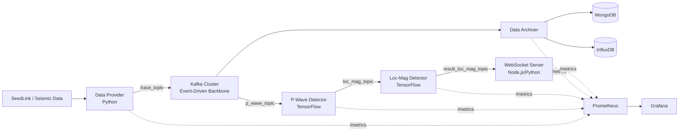

# GEMPA: Grafana-monitored Event-driven Microservices for P-wave Alerts

<div align="center">
  <a href="#english-version"><strong>🇬🇧 English Version</strong></a> | 
  <a href="#versi-bahasa-indonesia"><strong>🇮🇩 Versi Bahasa Indonesia</strong></a>
</div>

---

<a id="english-version"></a>
# 🇬🇧 English Version

**GEMPA** (Grafana-monitored Event-driven Microservices for P-wave Alerts) is an Earthquake Early Warning System (EEWS) designed from scratch using a distributed **Event-Driven Microservices** architecture. 

The system ingests raw seismic data, processes it via deep learning models for P-Wave detection and Location-Magnitude estimation, archives the data, and broadcasts alerts in real-time. The primary contribution of this project is the integration of a **First-Class Observability Layer** using **Prometheus** and **Grafana**, allowing real-time, empirical evaluation of latency, CPU/Memory usage, throughput, and end-to-end data delay across all stateless microservices.

## 1. Architecture



## 2. Project Structure & Key Files

```text
GEMPA/
├── data_provider/                 # Ingests seismic data from SeedLink to Kafka
├── p_wave_detector/               # Deep learning model for P-Wave detection
├── p_wave_detector_load_balance/  # P-Wave detector exposed as a load-balanced HTTP endpoint
├── load_balancer/                 # Forwards Kafka messages to detector endpoints via HTTP
├── loc_mag_detector/              # Estimates earthquake hypocenter & magnitude
├── data_archiver/                 # Archives data into MongoDB and InfluxDB
├── api_server/                    # WebSocket server using Express.js & Socket.IO
├── fast_api/                      # WebSocket server using FastAPI
├── seismic_app/                   # Desktop PyQt dashboard (WebSocket client)
├── nginx/                         # NGINX reverse proxy & load balancer config
├── prometheus/                    # Prometheus scraping configuration
├── grafana/                       # Grafana dashboards and provisioning
├── tests/                         # PowerShell scripts for automated observability testing
├── docker-compose.yml             # Main orchestration file
└── README.md                      # Project documentation
```

## 3. Required Specifications

To run the entire microservices stack (including Kafka clusters and AI models) smoothly locally, the following specs are recommended:
- **OS:** Windows 10/11 (with WSL2) or Ubuntu 20.04+
- **CPU:** Minimum 4 Cores (8 Cores recommended for multi-container tests)
- **RAM:** Minimum 16 GB (8-12 GB consumed by the active stack)
- **Storage:** 30 GB of free space
- **Software:** Docker Desktop (Windows) or Docker Engine (Linux), Git, Python 3.10+, PowerShell 5.1+

## 4. How to Run the Application

1. **Clone the repository:**
   ```powershell
   git clone https://github.com/mohamadsolkhannawawi/GEMPA.git
   cd GEMPA
   ```
2. **Setup environment variables:**
   ```powershell
   Copy-Item .env.example .env
   Copy-Item influxDB\.env.example influxDB\.env
   ```
3. **Start the containers:**
   ```powershell
   docker compose up -d --build
   ```
4. **Wait for initialization:** Kafka and Zookeeper take ~60 seconds to fully initialize and elect leaders. Check the status using:
   ```powershell
   docker compose ps
   ```
   All main services must show `Up (healthy)`.

## 5. How to Monitor (Grafana & Prometheus)

- **Grafana Dashboard:** Open `http://localhost:4000` (Login: `admin` / `12345678`). Navigate to the **EEWS Observability** dashboard to see real-time charts.
- **Prometheus Targets:** Open `http://localhost:9090/targets`. Ensure all microservice endpoints are highlighted in green (UP).
- **InfluxDB:** Open `http://localhost:8086` (Login: `admin` / `12345678`) to explore raw time-series data.
- **Mongo Express:** Open `http://localhost:8081` (Login: `admin` / `password`) to view AI estimation records.

## 6. How to Test (Automated Observability Scenarios)

The project includes 5 rigorous testing scenarios designed to evaluate the architecture's performance. Run these using PowerShell from the `tests/` directory:

```powershell
cd tests

# S1: Ingestion Concurrency Strategy (Threads vs Processes)
.\run_s1_dataprovider.ps1

# S2: Prometheus Instrumentation Overhead
.\run_s2_overhead.ps1

# S3: Multi-Container Scalability (Archiver & AI Detectors)
.\run_s3_scalability_archiver.ps1
.\run_s3_scalability_pwave.ps1

# S4: WebSocket Server Comparison (Express.js vs FastAPI)
.\run_s4_websocket.ps1

# S5: Broker Load Balancing Topology (Kafka vs Kafka+NGINX)
.\run_s5_loadbalancer.ps1

# Or run ALL scenarios consecutively (Takes 1.5 to 3 hours):
.\run_all_tests.ps1
```
Results are saved as `.csv` files in `tests/results/`.

## 7. Troubleshooting

- **Containers keep restarting (specifically Kafka):** Kafka takes time to establish leadership. Wait 60 seconds. View logs via `docker compose logs --tail=50 kafka1`.
- **CPU > 100% or Laptop Freezing:** Reduce the load generator configuration in the `.env` file (set `DATA_PROVIDER_NUM_PROCESSES=2` and `DATA_PROVIDER_NUM_STATIONS=50`).
- **Missing AI Models:** Ensure `model_p_wave.h5` and `model_loc_mag.h5` are present in their respective detector folders before building.
- **Permission Denied when saving CSV:** Ensure no test `.csv` files are currently opened in Excel while the test scripts are running.

## 8. License & Author
- **Author:** Mohamad Solkhan Nawawi
- **License:** MIT License

---

<br><br>

<a id="versi-bahasa-indonesia"></a>
# 🇮🇩 Versi Bahasa Indonesia

**GEMPA** (Grafana-monitored Event-driven Microservices for P-wave Alerts) adalah Sistem Peringatan Dini Gempa Bumi (EEWS) yang dirancang menggunakan arsitektur **Event-Driven Microservices** terdistribusi.

Sistem ini menerima data seismik mentah, memprosesnya melalui model *deep learning* untuk mendeteksi gelombang-P dan estimasi Lokasi-Magnitudo, mengarsipkan data, serta menyebarkan peringatan secara *real-time*. Kontribusi utama penelitian ini adalah integrasi **Lapisan Observabilitas Kelas Satu** menggunakan **Prometheus** dan **Grafana**, yang memungkinkan evaluasi empiris *real-time* terhadap latensi, penggunaan CPU/Memori, *throughput*, dan *delay data end-to-end* di seluruh *microservices* yang *stateless*.

## 1. Arsitektur


## 2. Struktur Proyek & File Penting

```text
GEMPA/
├── data_provider/                 # Ingesti data seismik dari SeedLink ke Kafka
├── p_wave_detector/               # Model deep learning untuk deteksi gelombang-P
├── p_wave_detector_load_balance/  # Endpoint HTTP load-balanced untuk P-Wave
├── load_balancer/                 # Meneruskan pesan Kafka ke endpoint detector via HTTP
├── loc_mag_detector/              # Estimasi hiposenter & magnitudo gempa
├── data_archiver/                 # Mengarsipkan data ke MongoDB dan InfluxDB
├── api_server/                    # WebSocket server menggunakan Express.js & Socket.IO
├── fast_api/                      # WebSocket server menggunakan FastAPI
├── seismic_app/                   # Dasbor desktop PyQt (Klien WebSocket)
├── nginx/                         # Konfigurasi reverse proxy & load balancer NGINX
├── prometheus/                    # Konfigurasi scraping target Prometheus
├── grafana/                       # Dashboard dan provisioning Grafana
├── tests/                         # Skrip PowerShell untuk pengujian observabilitas otomatis
├── docker-compose.yml             # File utama orkestrasi Docker
└── README.md                      # Dokumentasi proyek
```

## 3. Spesifikasi yang Dibutuhkan

Untuk menjalankan seluruh tumpukan (termasuk *cluster* Kafka dan model AI) dengan lancar di komputer lokal, spesifikasi berikut sangat direkomendasikan:
- **OS:** Windows 10/11 (dengan WSL2) atau Ubuntu 20.04+
- **CPU:** Minimum 4 Core (Sangat disarankan 8 Core untuk pengujian multi-container)
- **RAM:** Minimum 16 GB (8-12 GB akan dikonsumsi oleh aplikasi saat aktif penuh)
- **Penyimpanan:** Ruang kosong 30 GB
- **Software:** Docker Desktop (Windows) atau Docker Engine (Linux), Git, Python 3.10+, PowerShell 5.1+

## 4. Cara Menjalankan Aplikasi

1. **Clone repositori:**
   ```powershell
   git clone https://github.com/mohamadsolkhannawawi/GEMPA.git
   cd GEMPA
   ```
2. **Siapkan environment variables:**
   ```powershell
   Copy-Item .env.example .env
   Copy-Item influxDB\.env.example influxDB\.env
   ```
3. **Nyalakan container:**
   ```powershell
   docker compose up -d --build
   ```
4. **Tunggu inisialisasi:** Kafka dan Zookeeper membutuhkan waktu ~60 detik untuk melakukan *startup* dan pemilihan *leader*. Cek status container menggunakan:
   ```powershell
   docker compose ps
   ```
   Pastikan seluruh layanan utama berstatus `Up (healthy)`.

## 5. Cara Pemantauan (Grafana & Prometheus)

- **Dasbor Grafana:** Buka `http://localhost:4000` (Login: `admin` / `12345678`). Masuk ke dasbor **EEWS Observability** untuk melihat grafik metrik *real-time*.
- **Target Prometheus:** Buka `http://localhost:9090/targets`. Pastikan semua endpoint layanan berwarna hijau (UP).
- **InfluxDB:** Buka `http://localhost:8086` (Login: `admin` / `12345678`) untuk melihat raw data *time-series*.
- **Mongo Express:** Buka `http://localhost:8081` (Login: `admin` / `password`) untuk melihat dokumen hasil deteksi AI.

## 6. Cara Testing (Skenario Uji Observabilitas Otomatis)

Proyek ini dilengkapi dengan 5 skenario pengujian ketat untuk mengevaluasi arsitektur. Jalankan menggunakan PowerShell dari direktori `tests/`:

```powershell
cd tests

# S1: Strategi Konkurensi Ingesti (Thread vs Process)
.\run_s1_dataprovider.ps1

# S2: Overhead Instrumentasi Prometheus
.\run_s2_overhead.ps1

# S3: Skalabilitas Multi-Container (Archiver & P-Wave Detector)
.\run_s3_scalability_archiver.ps1
.\run_s3_scalability_pwave.ps1

# S4: Perbandingan WebSocket Server (Express.js vs FastAPI)
.\run_s4_websocket.ps1

# S5: Topologi Load Balancer Broker (Kafka Native vs Kafka+NGINX)
.\run_s5_loadbalancer.ps1

# Atau jalankan SEMUA skenario secara berurutan (Butuh 1.5 hingga 3 Jam):
.\run_all_tests.ps1
```
Hasil akan disimpan sebagai file `.csv` di dalam folder `tests/results/`.

## 7. Troubleshooting (Pemecahan Masalah)

- **Container sering restart (khususnya Kafka):** Kafka butuh waktu untuk inisialisasi awal. Tunggu sekitar 60 detik. Cek log dengan `docker compose logs --tail=50 kafka1`.
- **CPU > 100% atau Laptop Lag Parah:** Turunkan beban *load generator* di dalam file `.env` (atur `DATA_PROVIDER_NUM_PROCESSES=2` dan `DATA_PROVIDER_NUM_STATIONS=50`).
- **Model AI Tidak Ditemukan:** Pastikan file `model_p_wave.h5` dan `model_loc_mag.h5` sudah ada di dalam folder masing-masing sebelum menjalankan perintah *build*.
- **Permission Denied saat membuat CSV:** Pastikan tidak ada file hasil uji (CSV) yang sedang dibuka di Excel atau aplikasi lain saat skrip PowerShell sedang berjalan.

## 8. Lisensi & Penulis
- **Penulis:** Mohamad Solkhan Nawawi
- **Lisensi:** MIT License
